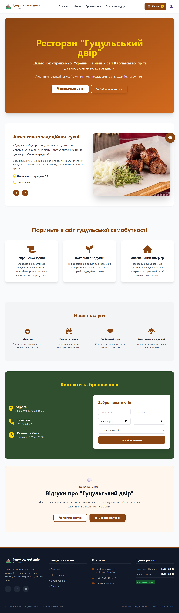
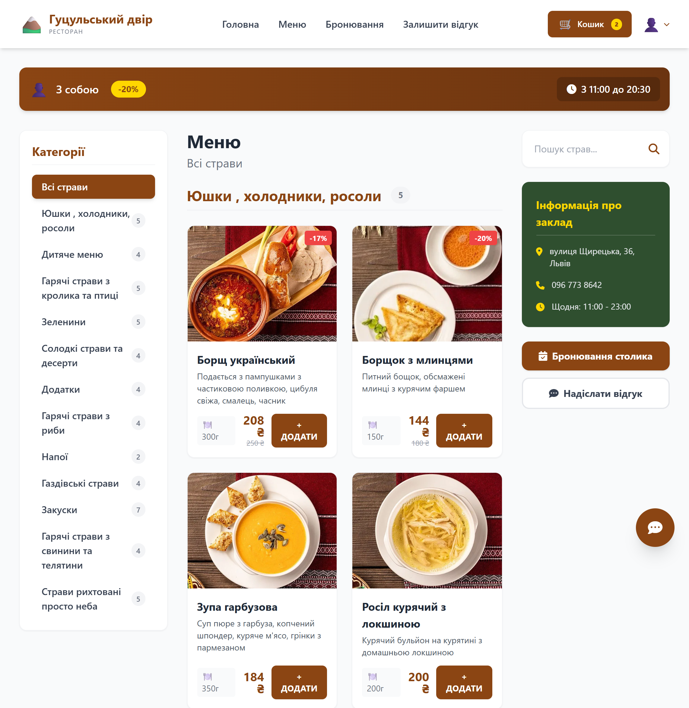
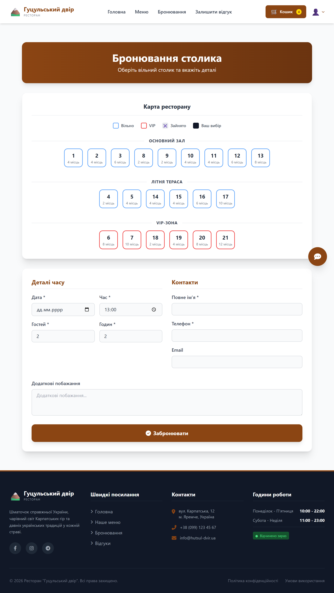
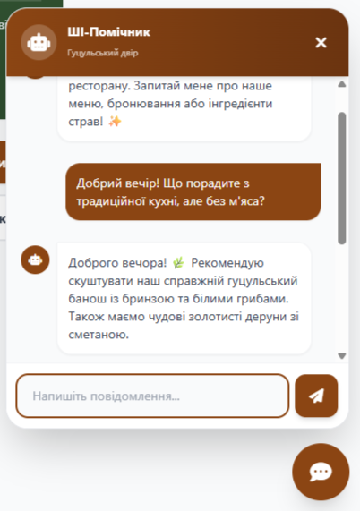
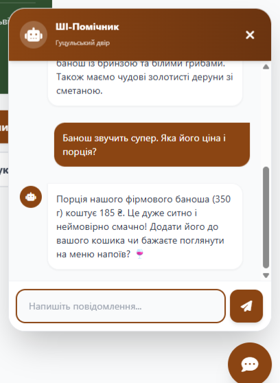
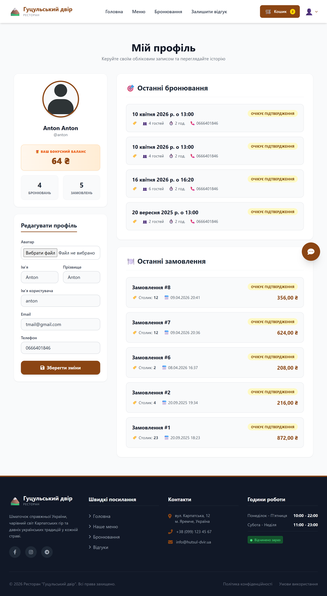
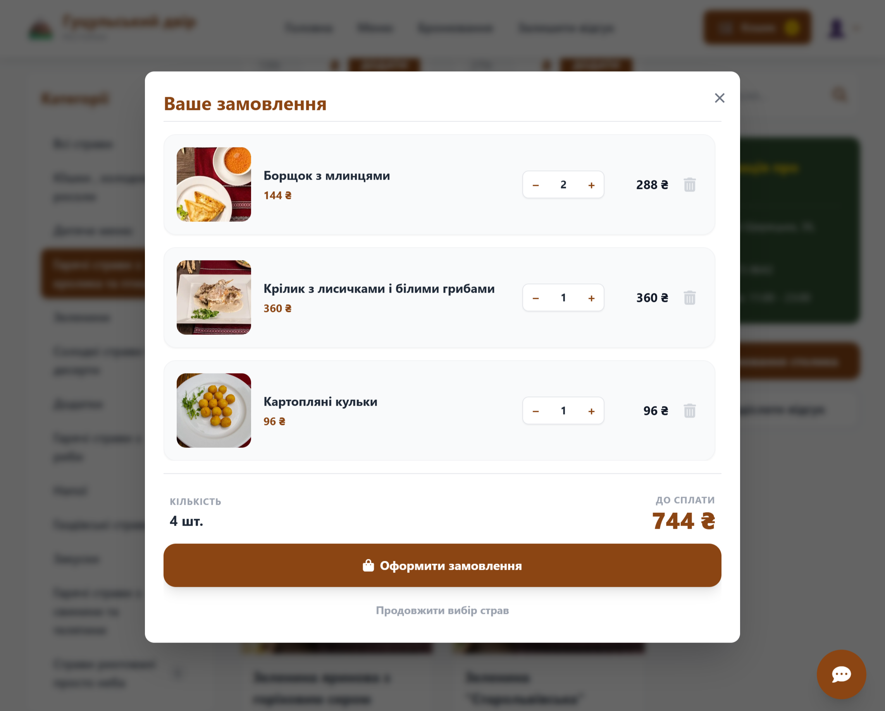
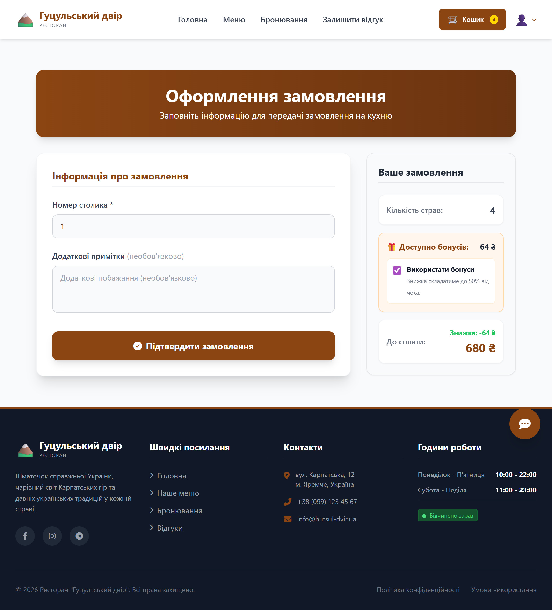

# 🍽️ Restorant App - Система керування рестораном "Гуцульський двір"

Сучасний веб-застосунок для ресторану, написаний на Django, який дозволяє клієнтам переглядати меню, замовляти страву онлайн, бронювати столики та спілкуватися з інтелектуальним AI-помічником.

## 🚀 Основний функціонал

- **🛒 Система замовлень та Кошик**: Повноцінний цикл вибору страв, додавання до кошика та оформлення замовлення.
- **📅 Бронювання столиків**: Можливість обрати зону (Основний зал, Тераса, VIP) та забронювати столик на певну дату й час.
- **🤖 AI-Асистент (Gemini)**: Інтегрований чат-бот, який консультує гостей щодо меню, графіку роботи та особливостей закладу.
- **💰 Бонусна система**: Нарахування бонусних балів за замовлення та можливість використовувати їх для оплати.
- **💬 Відгуки та коментарі**: Система фідбеку від клієнтів з можливістю залишати коментарі до закладу.
- **🔐 Авторизація (AllAuth)**: Реєстрація через Email або соціальні мережі (Google, GitHub, Apple).
- **📱 Особистий кабінет**: Керування профілем, перегляд історії замовлень та балансу бонусів.
- **🛠️ Адмін-панель**: Повне керування меню, замовленнями, користувачами та бронюваннями.

## 🛠️ Технологічний стек

- **Backend**: Python 3.12, Django 5.2
- **Database**: PostgreSQL
- **AI Integration**: Google Generative AI (Gemini 1.5 Flash)
- **Frontend**: Django Templates, Bootstrap 5, Vanilla JS
- **Auth**: Django-Allauth (OAuth2 support)
- **Containerization**: Docker, Docker Compose
- **Image Processing**: Pillow

## 📸 Скріншоти проєкту

### Головна сторінка


### Меню


### Бронювання


### AI-Асистент



### Профіль 


### Кошик


### Замовлення


---

## 📦 Запуск через Docker (найшвидший спосіб)

1. **Клонуйте репозиторій**:
   ```bash
   git clone <ваш-url-репозиторію>
   cd restorant-app
   ```

2. **Запустіть контейнери**:
   ```bash
   docker-compose up --build
   ```

3. **Застосуйте міграції (у новому терміналі)**:
   ```bash
   docker exec -it restorant_web python manage.py migrate
   ```

4. **Створіть суперкористувача**:
   ```bash
   docker exec -it restorant_web python manage.py createsuperuser
   ```

Сайт буде доступний за адресою: `http://localhost:8000`

---

## 🛠️ Локальний запуск (без Docker)

1. **Створіть віртуальне оточення**:
   ```bash
   python -m venv venv
   source venv/bin/activate  # для Linux/macOS
   venv\Scripts\activate     # для Windows
   ```

2. **Встановіть залежності**:
   ```bash
   pip install -r requirements.txt
   ```

3. **Налаштуйте базу даних PostgreSQL**:
   Створіть базу даних з назвою `restorant_app` та користувача, як вказано в `settings.py` (або змініть налаштування під себе).

4. **Виконайте міграції**:
   ```bash
   python manage.py migrate
   ```

5. **Запустіть сервер**:
   ```bash
   python manage.py runserver
   ```

---

## 🔑 Налаштування AI-Асистента

Для роботи чат-бота необхідно отримати API ключ від [Google AI Studio](https://aistudio.google.com/).

1. Відкрийте файл `ai_assistant/views.py`.
2. Знайдіть змінну `GEMINI_API_KEY`.
3. Вставте ваш ключ.

---

## 📂 Структура проєкту

- `main/` - Головна сторінка та загальна логіка.
- `dish/` - Управління меню та категоріями страв.
- `carts/` - Логіка кошика покупок.
- `orders/` - Оформлення та обробка замовлень.
- `users/` - Розширена модель користувача та профілі.
- `booking/` - Система резервування столиків.
- `comments/` - Відгуки та коментарі клієнтів.
- `ai_assistant/` - Інтеграція з Google Gemini API.
- `static/` - CSS, JS та іконки проєкту.
- `templates/` - HTML-шаблони.
